# Dippin - 음악 취향 공유 SNS

## 프로젝트 소개

디핑은 기존의 음악플레이어 기능을 넘어서 사람들과 음악 청취 경험을 공유할 수 있는 SNS와 뮤직 플레이어를 합친 소셜 뮤직 네트워크 서비스 입니다.

## 프로젝트 개요

🎵 음악 취향 공유 SNS 웹서비스 🎶

- 기본 SNS 기능 제공(팔로잉, 팔로워, 프로필, etc)
- 나만의 플레이리스트를 공유하는 포스트 '피드'
- 음악 취향과 관련된 주제로 끊임없이 대화를 이어나가는 게시판 '디핑'

## 개발 환경 및 기술 스택

### 아키텍처

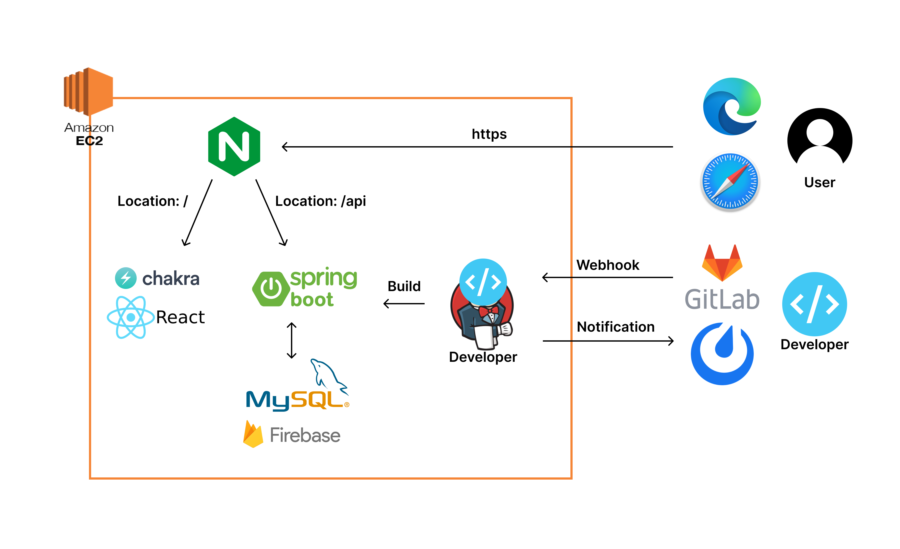

### Backend - Spring

- IntelliJ IDE
- Springboot 2.7.2
- Spring Data JPA
- Spring Security
- Spring Web
- Swagger 3.0.0
- Firebase 9.0.0
- MySql 8.0.30

### Frontend

- Visual Studio Code IDE
- React 18.2.0
- ChakraUI 2.2.4
- TypeScript

### CI/CD

- AWS EC2
- Jenkins
- NGINX

## 핵심 기능

- 다크모드 지원
- 포스트
    - 일반적인 SNS 게시물을 작성하듯이 노래들을 실시간 검색하여 담고, 플레이리스트로 저장할 수 있습니다.
    - 포스트를 작성할 때 포스트를 팔로워들에게만 공개할 수 있도록 설정할 수 있습니다.
    - 포스트를 작성할 때 댓글 잠금을 통해 사용자들이 댓글 작성을 막을 수 있습니다.
- 홈
    - 팔로우 중인 사람들의 게시물을 확인할 수 있습니다
    - 게시물을 확인하고 좋아요, 답글을 달 수 있습니다.
    - 게시물에 있는 노래 목록 확인 버튼을 통해서 플레이리스트 목록을 확인할 수 있습니다.
    - 플레이리스트에 있는 곡들을 선택하여 실시간 스트리밍 재생할 수 있습니다.
- 디핑
    - 사용자들에게 직접적인 취향 공유를 받을 수 있는 디핑 게시물의 차별점입니다.
    - 제목과 내용을 작성하고, 노래를 검색하여 추가하여 디핑을 작성할 수 있습니다.
    - 자신이 작성한 디핑 안의 노래들과 추천받은 노래들을  선택하여 직접 포스트로 작성할 수 있습니다.
- 검색
    - 검색 탭에서 전체 포스트를 확인할 수 있습니다.
    - 전체 포스트내용을 검색 키워드를 통해 검색할 수 있습니다.
    - 포스트 내용을 조회하여 음악을 재생할 수 있습니다
    - 검색 탭에서 사용자 닉네임으로 검색할 수 있습니다
- 프로필
    - 자신의 팔로워와 팔로잉 중인 사람의 수, 자신이 작성한 게시물의 수 등의 기본적인 정보를 확인할 수 있습니다.
    - 자신이 작성한 포스트, 디핑 게시물을 전체 확인할 수 있습니다.
    - 다른 사람의 프로필을 들어가서 팔로우 요청을 보낼 수 있습니다.

## 프로젝트 결과물

- 로그인/회원가입 페이지

- 

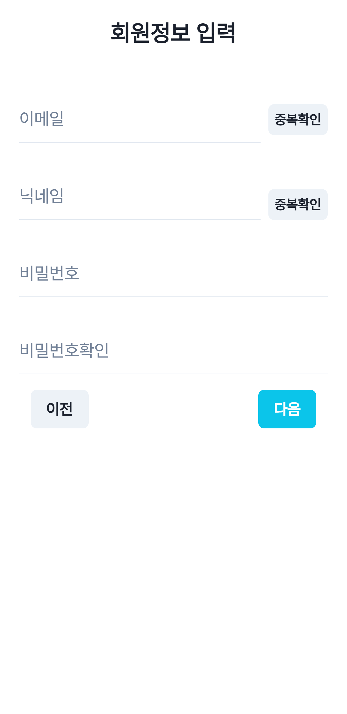

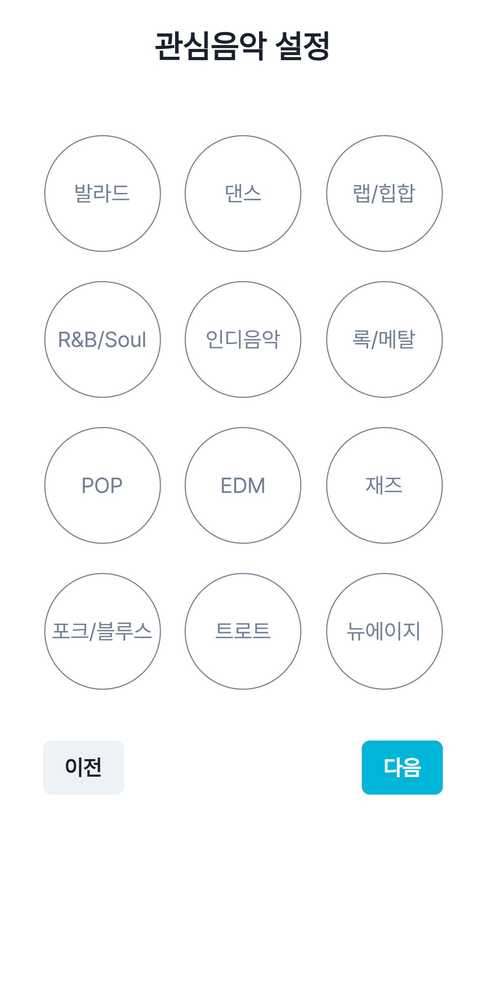

- 홈피드

- 홈피드- 재생목록

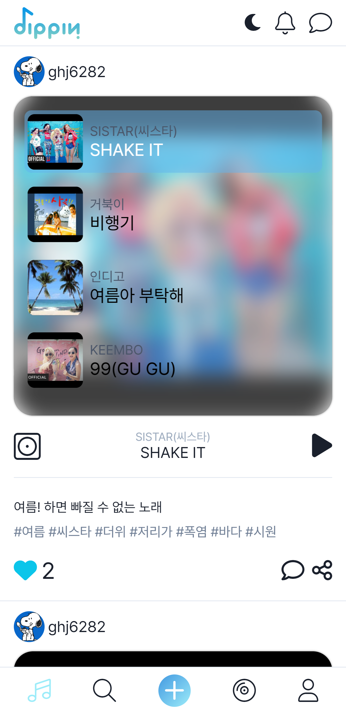

- 홈피드 - 댓글작성

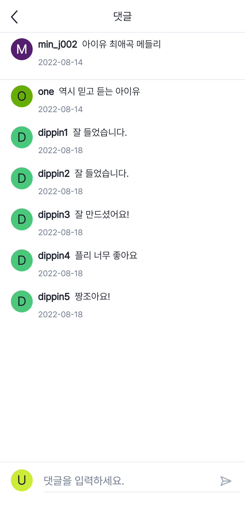

- 게시글 작성

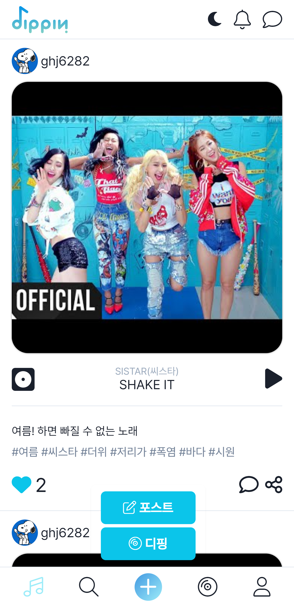

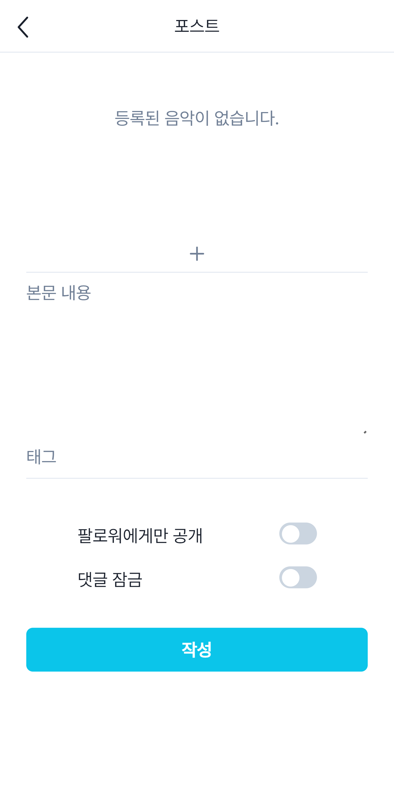

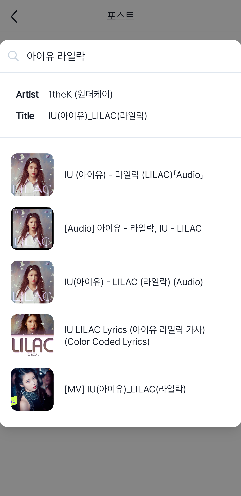

- 프로필 페이지

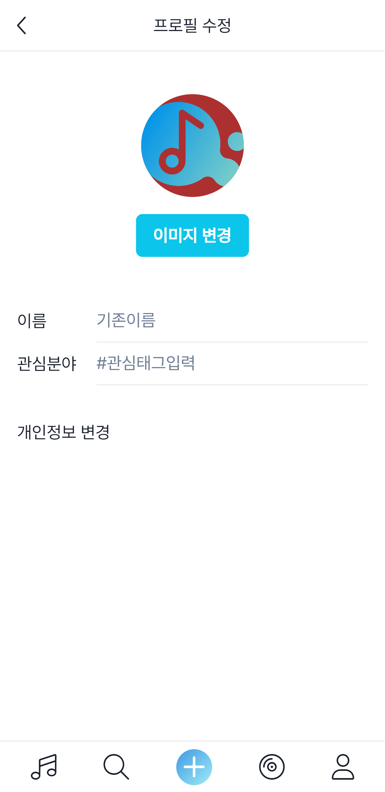

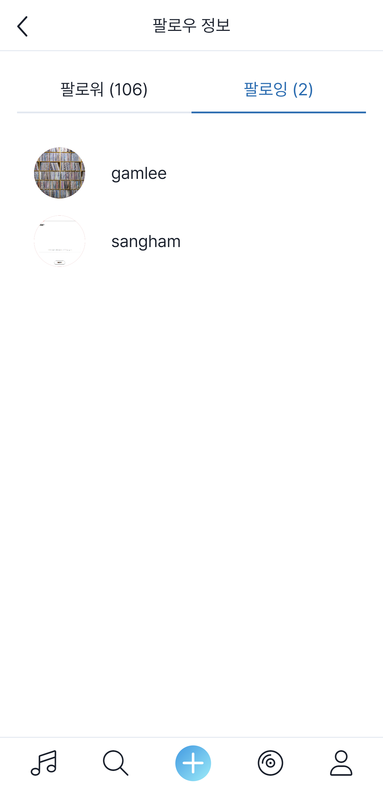

- 디핑

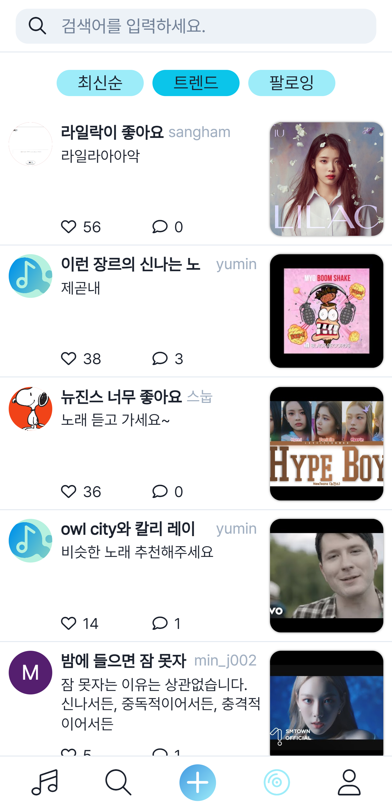

- 디핑 작성

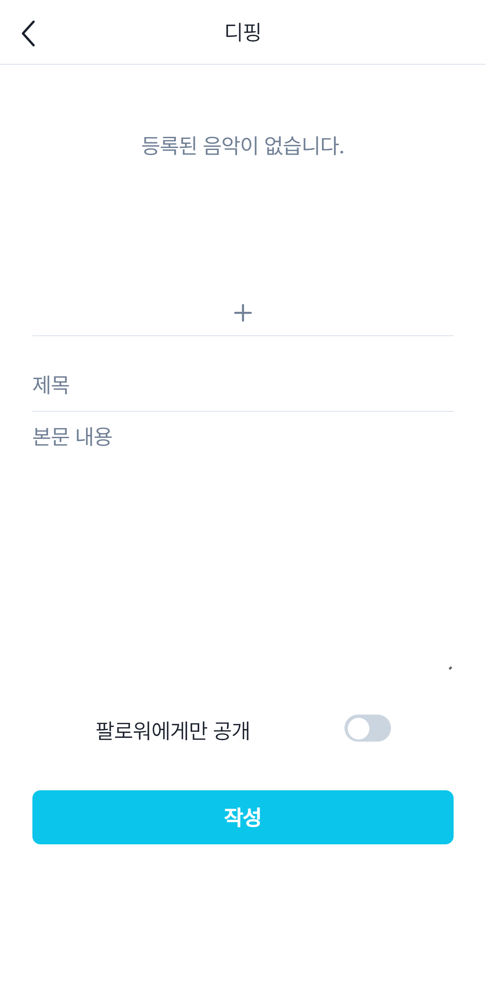

- 디핑 상세보기

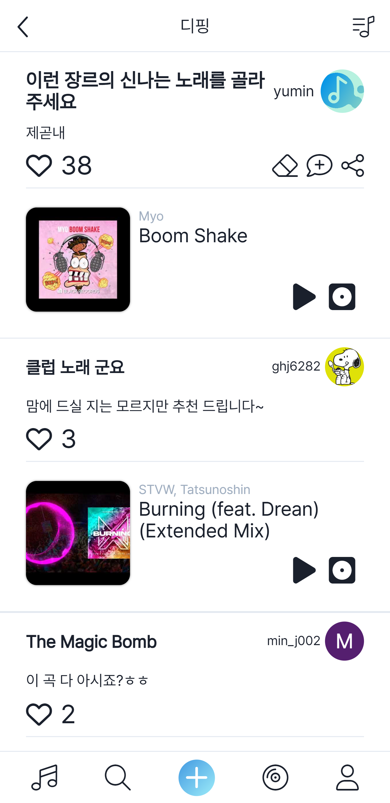

- 디핑 페이지 곡들로 포스트 작성

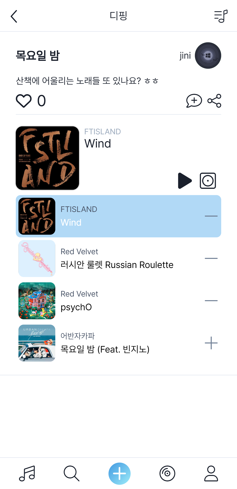

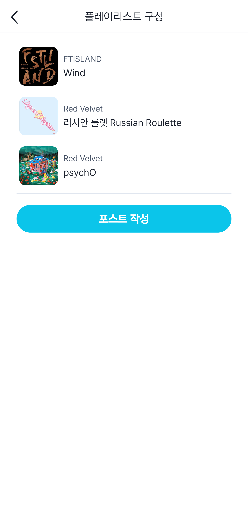

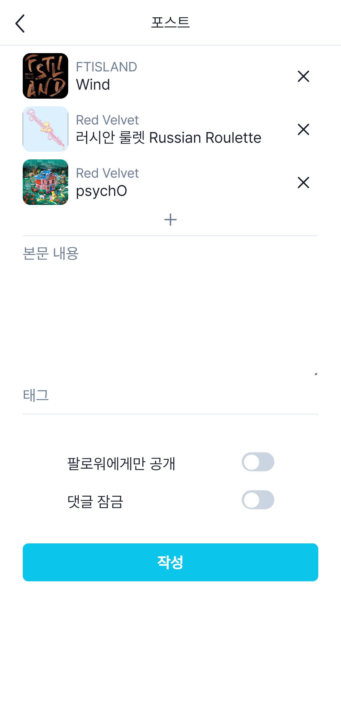

- 다크 모드

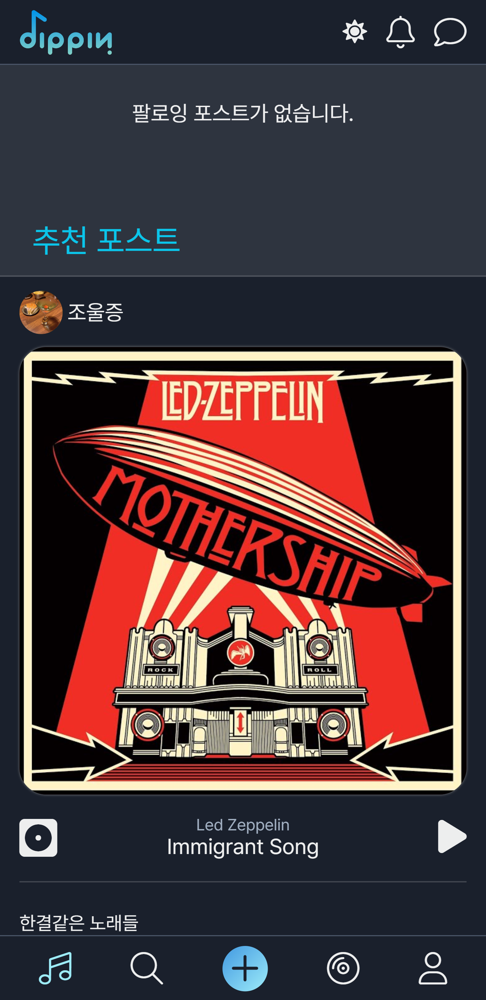

- 검색-사용자

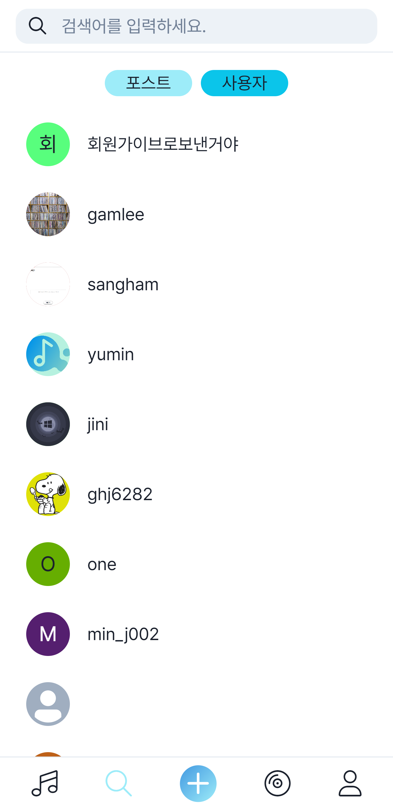

- 검색-포스트

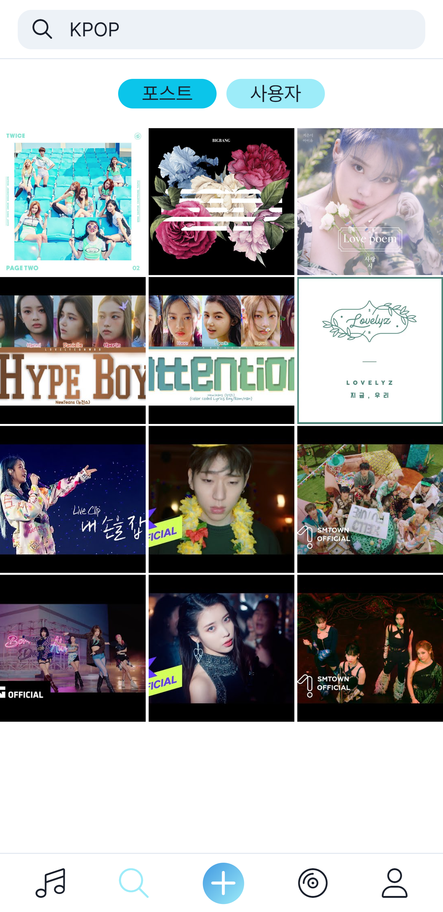
